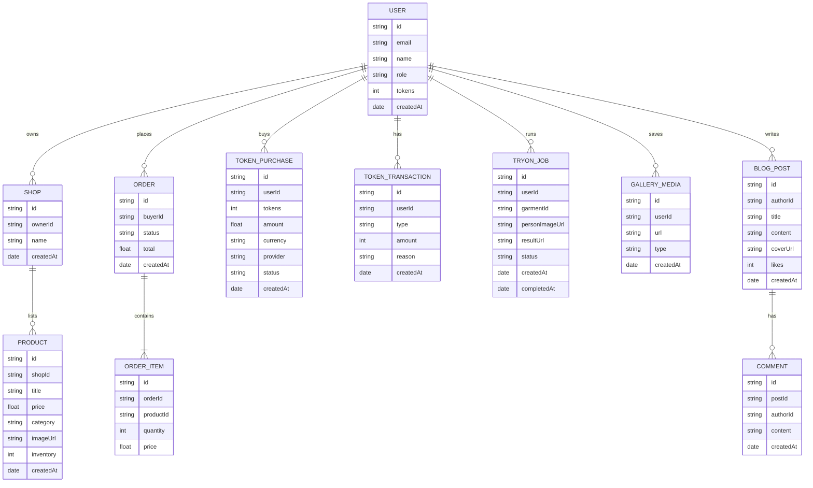

# Chương 2 — Sơ đồ Phân tích & Thiết kế (Mermaid)

## 1) Kiến trúc tổng quan hệ thống
```mermaid
flowchart LR
  subgraph Client[Frontend (Next.js App Router)]
    UI[UI Pages / Components]
  end

  subgraph Backend[Backend (Next.js API Routes)]
    TRYON[/api/tryon/]
    GENIMG[/api/generate-image/]
    PROMPT[/api/generate-prompt/]
    UPLOAD[/api/upload/]
    PRESIGN[/api/upload/presigned-url/]
    TOKENS[/api/tokens/*]
    AUTH[/api/auth/*]
    TOKENM[Token Manager]
    AUTHM[Auth/JWT]
  end

  subgraph ExternalAI[External AI Services]
    FASHN[Fashn API (IDM-VTON)]
    OPENAI[OpenAI Images]
    OPENROUTER[OpenRouter LLM]
  end

  subgraph Storage[Storage & Database]
    S3[(AWS S3)]
    DB[(Prisma Database)]
  end

  STRIPE[Stripe Payment]

  UI --> TRYON
  UI --> GENIMG
  UI --> PROMPT
  UI --> UPLOAD
  UI --> PRESIGN
  UI --> TOKENS
  UI --> AUTH

  TRYON --> TOKENM
  GENIMG --> TOKENM
  TOKENS --> STRIPE
  TOKENS --> DB

  TRYON --> FASHN
  GENIMG --> OPENAI
  PROMPT --> OPENROUTER

  TRYON --> S3
  GENIMG --> S3
  UPLOAD --> S3
  PRESIGN --> S3

  TRYON --> DB
  GENIMG --> DB
  AUTH --> AUTHM
```

## 2) Use Case chính và Actors


## 3) Activity Diagram — Thực hiện thử đồ ảo


## 4) Sequence Diagram — Try-on end-to-end


## 5) State Diagram — Trạng thái job Try-on


## 6) ER Diagram — Mô hình dữ liệu chính


## 7) Sequence — Mua token qua Stripe


## 8) Flow — AI Recommendation


## 9) Sequence — Upload với Presigned URL


## 10) Sequence — Tạo ảnh bằng OpenAI (DALL·E)


## 11) Flow — Kênh Người bán & Quản trị


## 12) Flow — Blog & Media


## 13) Bản đồ API chính (App Router)
```mermaid
flowchart TB
  subgraph API Routes
    A1[/api/tryon/]
    A2[/api/tryon/status/:jobId]
    A3[/api/generate-image/]
    A4[/api/generate-prompt/]
    A5[/api/upload/]
    A6[/api/upload/presigned-url/]
    T1[/api/tokens/purchase/]
    T2[/api/tokens/confirm-stripe/]
    T3[/api/tokens/payment-webhook/]
    T4[/api/tokens/balance/]
    B1[/api/blog/posts/]
    B2[/api/blog/posts/:id]
    B3[/api/blog/posts/:id/like]
    B4[/api/blog/posts/:id/save]
    B5[/api/blog/posts/:id/comments]
    AU1[/api/auth/login/]
    AU2[/api/auth/logout/]
    AU3[/api/auth/register/]
  end
```

## 14) Deployment & tích hợp


> Lưu ý: Các sơ đồ phản ánh đúng kiến trúc và luồng xử lý hiện tại trong codebase (Next.js App Router, API routes, S3, Prisma, Stripe, Fashn/OpenAI/OpenRouter, Token/JWT). Có thể mở file này bằng bất kỳ viewer hỗ trợ Mermaid để render.
