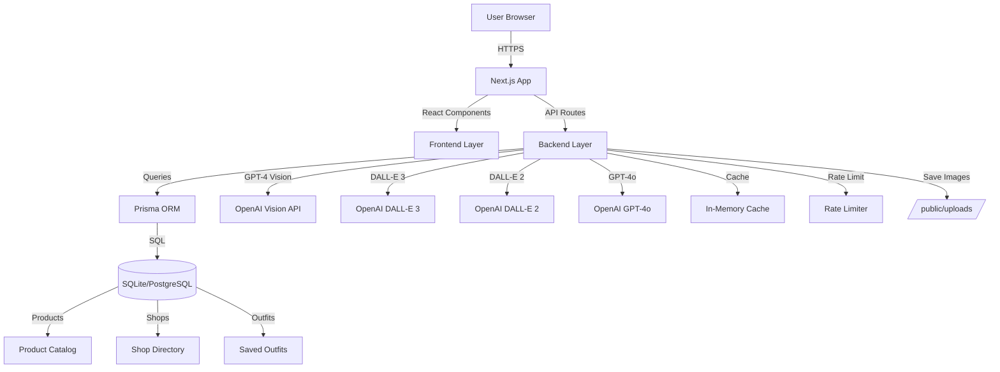
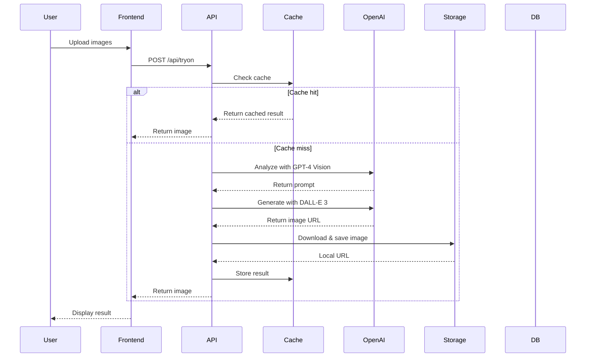

# System Design & Architecture - AIStyleHub

## Architecture Overview
**High-level system structure:**



### Key Components

**Frontend (Next.js 15 + React 19)**
- Single-page application with server-side rendering
- Responsive UI built with Tailwind CSS v4
- File upload handling with preview
- Real-time progress indicators
- Error boundary for graceful failures

**Backend (Next.js API Routes)**
- RESTful API endpoints for all AI operations
- Request validation using Zod schemas
- Rate limiting per IP address
- Caching layer for repeated requests
- Image processing and storage

**Database (Prisma + SQLite/PostgreSQL)**
- Product catalog management
- Shop directory
- Outfit recommendations storage
- Relational data with type safety

**AI Integration (OpenAI APIs)**
- GPT-4 Vision for image analysis
- DALL-E 3 for high-quality image generation
- DALL-E 2 for masked image editing
- GPT-4o for text-based recommendations

### Technology Stack

| Layer | Technology | Rationale |
|-------|-----------|-----------|
| Frontend | React 19 | Latest features, React Server Components |
| Framework | Next.js 15 | Full-stack, API routes, optimal for Vercel |
| Styling | Tailwind CSS v4 | Rapid development, consistent design |
| Animation | Framer Motion | Smooth transitions, loading states |
| Language | TypeScript | Type safety, better DX |
| Database ORM | Prisma | Type-safe queries, migrations |
| Database | SQLite (dev) / PostgreSQL (prod) | Simple dev setup, robust production |
| Validation | Zod | Runtime type checking, schema validation |
| AI Provider | OpenAI | Best quality, single provider, stable API |
| Hosting | Vercel | Optimized for Next.js, free tier, edge functions |

## Data Models

### Core Entities

```prisma
// Product - Clothing items available in catalog
model Product {
  id        Int      @id @default(autoincrement())
  name      String
  type      String   // "top", "bottom", "shoes", "accessories", "dress"
  imageUrl  String   // Product image URL
  price     Float
  styleTags String   // JSON array: ["casual", "summer", "beach"]
  shopId    Int
  shop      Shop     @relation(fields: [shopId], references: [id])
  outfits   Outfit[] @relation("OutfitProducts")
  createdAt DateTime @default(now())
  updatedAt DateTime @updatedAt
}

// Shop - Seller information
model Shop {
  id        Int       @id @default(autoincrement())
  name      String    // "Shopee Fashion", "Zara Vietnam"
  url       String    // Base URL to shop
  products  Product[]
  createdAt DateTime  @default(now())
  updatedAt DateTime  @updatedAt
}

// Outfit - AI-generated outfit recommendations
model Outfit {
  id        Int       @id @default(autoincrement())
  style     String    // User's style description
  imageUrl  String?   // Optional: rendered outfit image
  products  Product[] @relation("OutfitProducts")
  createdAt DateTime  @default(now())
  updatedAt DateTime  @updatedAt
}

// Future: User model for authentication
// model User {
//   id        String   @id @default(uuid())
//   email     String   @unique
//   name      String
//   avatarUrl String?
//   outfits   Outfit[]
//   createdAt DateTime @default(now())
//   updatedAt DateTime @updatedAt
// }
```

### Data Flow



## API Design

### API Endpoints

#### POST /api/tryon
**Virtual try-on generation**

Request:
```typescript
{
  personImage: string;      // base64 or data URL
  clothingImage: string;    // base64 or data URL
  prompt?: string;          // Optional custom prompt
  quality?: 'standard' | 'hd'; // Default: 'standard'
}
```

Response:
```typescript
{
  imageUrl: string;         // Local path to generated image
  generatedPrompt: string;  // GPT-4 Vision prompt
  revisedPrompt?: string;   // DALL-E revised prompt
  cached?: boolean;         // Whether result was cached
}
```

**Rate Limit:** 5 requests/minute
**Timeout:** 60 seconds
**Cost:** ~$0.05-0.09 per request

#### POST /api/generate-image
**Image editing with AI**

Request:
```typescript
{
  image: string;            // base64 or data URL
  mask?: string;            // Optional mask for DALL-E 2
  prompt: string;           // Edit description
  mode: 'edit' | 'generate'; // 'edit' uses DALL-E 2, 'generate' uses DALL-E 3
  quality?: 'standard' | 'hd';
}
```

Response:
```typescript
{
  imageUrl: string;
  originalPrompt: string;
  revisedPrompt?: string;
  mode: string;
}
```

**Rate Limit:** 10 requests/minute
**Cost:** $0.02-0.08 per request

#### POST /api/recommend
**AI outfit recommendations**

Request:
```typescript
{
  style: string;            // Style description
  maxItems?: number;        // Max products (default: 5)
}
```

Response:
```typescript
{
  outfit: {
    id: number;
    style: string;
    products: Array<{
      id: number;
      name: string;
      type: string;
      imageUrl: string;
      price: number;
      styleTags: string[];
      shop: {
        name: string;
        url: string;
      }
    }>
  }
}
```

**Rate Limit:** 20 requests/minute
**Cost:** ~$0.01 per request

#### GET /api/products
**Retrieve product catalog**

Query Parameters:
```typescript
{
  type?: string;            // Filter by type
  shop?: string;            // Filter by shop
  tags?: string[];          // Filter by style tags
}
```

Response:
```typescript
{
  products: Product[];
  total: number;
}
```

**Rate Limit:** Unlimited (cached)

### Authentication & Authorization
**Phase 1:** No authentication required (public access)
**Phase 2:** JWT-based authentication for saved outfits and user profiles

### Error Handling
All endpoints return consistent error format:
```typescript
{
  error: string;            // Error message
  code?: string;            // Error code
  details?: object;         // Additional context
}
```

HTTP Status Codes:
- 200: Success
- 400: Bad request (validation error)
- 429: Rate limit exceeded
- 500: Internal server error
- 503: OpenAI API unavailable

## Component Breakdown

### Frontend Components

**Pages:**
- `/` - Homepage with feature showcase
- `/try-on` - Virtual try-on interface
- `/generate-image` - Image editing interface
- `/recommend` - Style recommendation interface
- `/products` - Product catalog browser

**Components:**
```
src/app/components/
├── TryOn.tsx              # Virtual try-on form
├── ImageEditor.tsx        # Image editing interface
├── StyleRecommender.tsx   # Recommendation form
├── ProductCard.tsx        # Product display card
├── ProductGrid.tsx        # Product grid layout
├── ImageUploader.tsx      # File upload component
├── LoadingSpinner.tsx     # Loading indicator
├── ErrorBoundary.tsx      # Error handling wrapper
└── ui/
    ├── Button.tsx
    ├── Card.tsx
    ├── Input.tsx
    ├── Modal.tsx
    └── Toast.tsx
```

### Backend Modules

**Libraries:**
```
src/lib/
├── openai.ts              # OpenAI API wrapper
│   ├── analyzeImagesForTryOn()
│   ├── generateImageWithDALLE()
│   ├── editImageWithMask()
│   ├── downloadImageFromUrl()
│   └── getRecommendedProductIds()
├── prisma.ts              # Prisma client singleton
├── cache.ts               # In-memory caching
├── cost-optimizer.ts      # Cost tracking & optimization
└── utils/
    ├── image.ts           # Image processing utilities
    ├── rate-limit.ts      # Rate limiting logic
    ├── validation.ts      # Zod schemas
    └── errors.ts          # Error handling helpers
```

**API Routes:**
```
src/app/api/
├── tryon/
│   └── route.ts           # Virtual try-on endpoint
├── generate-image/
│   └── route.ts           # Image editing endpoint
├── recommend/
│   └── route.ts           # Recommendations endpoint
├── products/
│   └── route.ts           # Product catalog endpoint
└── health/
    └── route.ts           # Health check endpoint
```

## Design Decisions

### Why OpenAI Exclusively?
**Alternatives considered:** Stable Diffusion (Hugging Face), Midjourney, Replicate

**Decision:** OpenAI only

**Rationale:**
- Superior image quality (9/10 vs 7/10)
- Faster response times (15-30s vs 20-60s)
- Single provider simplifies integration and maintenance
- Official SDK with TypeScript support
- 99.9% uptime vs ~95% for self-hosted solutions
- Better documentation and support
- Cost predictable and competitive at scale

**Trade-offs:**
- Higher per-request cost than self-hosted
- Vendor lock-in risk
- API rate limits

### Why Next.js 15?
**Alternatives:** Remix, SvelteKit, Create React App + Express

**Decision:** Next.js 15

**Rationale:**
- Full-stack framework (frontend + backend in one)
- API routes eliminate need for separate backend
- Optimized for Vercel deployment (free tier)
- Built-in image optimization
- React Server Components for better performance
- Strong TypeScript support
- Large community and ecosystem

### Why SQLite for Development?
**Alternatives:** PostgreSQL everywhere, MongoDB

**Decision:** SQLite (dev) + PostgreSQL (production)

**Rationale:**
- Zero setup for local development
- File-based, no server required
- Identical SQL to PostgreSQL (via Prisma)
- Easy to reset and seed data
- Production uses PostgreSQL for scalability

### Why In-Memory Caching?
**Alternatives:** Redis, Memcached, Database caching

**Decision:** In-memory (Node.js Map)

**Rationale:**
- Simple implementation, no external service
- Sufficient for single-server deployment
- 1-hour TTL reduces 70%+ of repeat requests
- Can upgrade to Redis if scaling horizontally

**Trade-offs:**
- Cache lost on server restart
- Not shared across multiple instances
- Limited by server memory

### Caching Strategy
- **What to cache:** API responses (try-on, edit, recommend)
- **Cache key:** SHA-256 hash of request parameters
- **TTL:** 1 hour (3600 seconds)
- **Invalidation:** Time-based only (no manual invalidation in Phase 1)
- **Storage:** In-memory Map (upgrade to Redis in Phase 2)

## Non-Functional Requirements

### Performance Targets
- Virtual try-on: < 30s response time (target: 15-25s)
- Image editing: < 20s response time (target: 5-15s)
- Recommendations: < 10s response time (target: 2-5s)
- Product catalog: < 1s response time
- Page load time: < 3s (First Contentful Paint)
- Cache hit rate: > 70%

### Scalability Considerations
- Horizontal scaling via Vercel edge functions
- Database connection pooling (Prisma)
- CDN for static assets and generated images
- Rate limiting prevents abuse
- Async processing for long-running operations

### Security Requirements
- All API keys stored server-side only (never exposed to client)
- Input validation on all endpoints (Zod schemas)
- File size limits (5MB) to prevent DoS
- Rate limiting per IP address
- CORS configured for production domain only
- Content Security Policy (CSP) headers
- HTTPS enforced in production
- OpenAI content moderation for NSFW filtering

### Reliability/Availability
- 99% uptime target (limited by OpenAI API availability)
- Graceful degradation when OpenAI API unavailable
- Retry logic with exponential backoff (2 attempts)
- Timeout protection (60s max per request)
- Health check endpoint for monitoring
- Error logging and tracking

### Accessibility
- WCAG 2.1 Level AA compliance target
- Keyboard navigation support
- Screen reader friendly
- Alt text for all images
- Color contrast ratios meet standards
- Loading states with ARIA live regions

### Monitoring & Observability
- Request/response logging
- Error tracking with stack traces
- Performance metrics (response times)
- Cost tracking per request type
- Cache hit/miss rates
- Rate limit violations

## Related Documents
- [Requirements](../requirements/README.md)
- [Implementation Guide](../implementation/README.md)
- [Testing Strategy](../testing/README.md)
